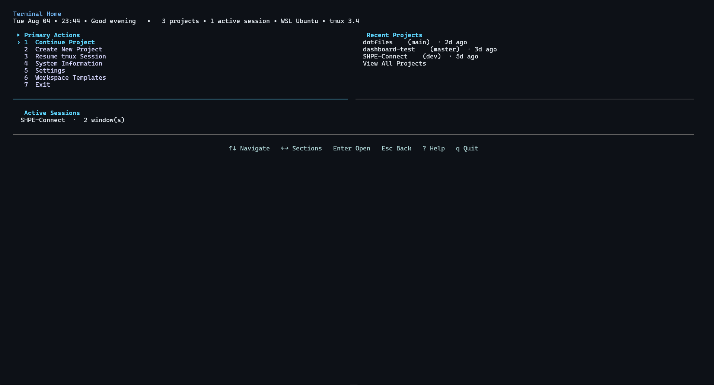

<div align="center">

# Terminal Home

A keyboard-driven terminal workspace manager for creating, configuring,
resuming, and rebuilding project-specific tmux environments.



[](https://github.com/PabloAlmanza47/Terminal-Home/actions/workflows/ci.yml)


</div>

## Why Terminal Home

Every project ends up needing the same handful of terminals: an editor, a
Git tool, a dev server, a test shell, an AI assistant. Rebuilding that layout
by hand every time you switch projects — cd into the directory, split panes,
launch each tool, get the sizing right — gets old fast. Terminal Home turns
that layout into something you configure once per project and either resume
(if it's still running) or recreate (if it isn't) from a searchable
dashboard.

## Features

- Searchable project dashboard with recent projects and running-session status
- Guided new-project wizard (name, folder, optional `git init`, workspace layout)
- Configurable tmux windows with 1-4 pane layouts per window
- Saved workspace persistence — layouts survive tmux restarts and WSL reboots
- Reusable local workspace templates with stable identity and independent copies
- Resume-if-running, recreate-if-not launch behavior with no duplicate sessions
- Neovim, Claude Code, Git (lazygit), file tree, test, dev server, blank shell,
  and custom-command pane types
- Graceful fallbacks when a preferred tool (e.g. `nvim`, `lazygit`) isn't installed
- Safe under custom tmux `base-index`/`pane-base-index` settings (see [Architecture](#architecture))
- Keyboard-first [Textual](https://textual.textualize.io/) interface

## Demo workflow

```
terminal-home
  -> Continue Project
    -> SHPE-Connect
      -> Resume Session   (or Recreate Workspace, if nothing's running)
        -> Neovim + Claude Code + dev server, tiled and ready
```

## Normal user installation

Terminal Home targets Linux and WSL with `tmux` installed. For a normal
installation, use an isolated application installer so `th` is available from
a new terminal without activating a repository virtual environment:

```bash
pipx install .
# or
uv tool install .
```

To install directly from GitHub:

```bash
pipx install "git+https://github.com/PabloAlmanza47/Terminal-Home.git"
# or
uv tool install "git+https://github.com/PabloAlmanza47/Terminal-Home.git"
```

After installation, open a new terminal and run `th` or `th doctor`.
`terminal-home` is the long command name. `dev` is retained as a compatibility
alias for older installations. Upgrade with `pipx install --force .` or
`uv tool install --upgrade .`; uninstall with `pipx uninstall terminal-home`
or `uv tool uninstall terminal-home`.

## Contributor installation

Cloning the repository and installing editable development dependencies is for
contributors and maintainers:

```bash
git clone https://github.com/PabloAlmanza47/Terminal-Home.git
cd Terminal-Home
python3 -m venv .venv
source .venv/bin/activate
python -m pip install -e ".[dev]"
tmux -V   # confirm tmux is installed and on PATH
```

Development-only tools such as pytest, Ruff, Mypy, and the build frontend are
not runtime dependencies. Terminal Home currently targets Linux and WSL;
native Windows and macOS workflows are not supported. WSL users should
install Linux `tmux` inside their WSL distribution.

**Required:** Python 3.10+, `tmux`.
**Optional:** `nvim`, `claude` (Claude Code), `lazygit`, `tree`, `git`, and
the package manager selected by a project's lockfile (`npm`, `pnpm`, `yarn`,
or `bun`). Tool-oriented panes fall back safely when their preferred tool is
missing; detected package scripts require their selected package manager.

## Building a local release

Maintainers can build an sdist and wheel locally without publishing them:

```bash
python -m pip install -e ".[dev]"
python -m build
```

The output is written to `dist/`. The package has one authoritative version in
`dashboard.__version__`; installed metadata and `th --version` derive from it.

### Maintainer release checklist

1. Update `dashboard.__version__` using `MAJOR.MINOR.PATCH` versioning.
2. Run the full test suite, Ruff, Mypy, and isolated build/install checks.
3. Review the generated wheel and sdist in a clean environment.
4. Create tags and releases manually when ready. CI uploads tagged artifacts
   but does not publish to PyPI automatically.

## Command-line interface

Plain `th` (or `terminal-home` / `dev`) opens the dashboard described below.
The CLI also provides inspection commands, project creation, and workspace launch:

```bash
th              # open the dashboard
th list         # list discovered projects and their status
th plan <project>  # preview the launch action without changing anything
th up <project>    # create or attach to the project's tmux workspace
th new my-project  # create a local project with safe defaults
th new my-project --no-git
th new my-project --path ~/school/csce331/my-project
th new my-project --template web-development
th new my-project --template python --no-launch
th doctor       # check local tools, stores, config paths, and project roots
th doctor --remote  # additionally inspect registered remote projects
th completion bash  # print Bash completion setup
th completion zsh   # print Zsh completion setup
```

`list`, `plan`, and `doctor` never create, attach to, or modify a tmux
session, and `plan` never saves a workspace or touches the filesystem — it
only reports what `th up` would do. `th up` attaches when the expected session
is already running, recreates and attaches when a saved workspace is stopped,
and otherwise persists the existing default workspace before creating and
attaching. Terminal Home never overwrites a running tmux session.

Project selectors may be a unique discovered name, an exact existing path, a
unique registered remote name, or an exact remote selector. Remote selectors
have the form `ssh:<host-id>:<remote-path>`. Duplicate names require an exact
path or remote selector. An explicit local path outside configured roots works,
but is not automatically registered in `projects.json`.

### Non-TUI project creation

`th new <project-name>` creates a local project without opening the Textual
dashboard. By default it derives a folder with the same slug behavior as the
wizard, creates it beneath `~/projects` (the current default project root),
initializes Git, uses the built-in default workspace, and launches that
workspace. Use `--path` for a complete destination or `--root` to choose a
parent directory. `--no-git` and `--no-launch` disable those defaults.

Registered local workspace templates can be selected with `--template`; the
template is copied into an independent project workspace and is never changed.
Unknown template names and existing destinations are rejected, and `th new`
never overwrites a directory. `--interactive` prompts for unspecified folder,
root, Git, template, and launch choices. `--non-interactive` never prompts and
uses the documented defaults. Plain usage uses defaults without emitting TUI
output; EOF accepts prompt defaults and Ctrl+C cancels an interactive request.

Creation is local-only: it does not create SSH projects, install packages, or
configure Git remotes. `th new` shares the same project-creation service as the
final step of the Textual wizard; opening the TUI remains the option for
custom pane-by-pane workspace design.

## SSH hosts and remote projects

Terminal Home uses the system OpenSSH `ssh` executable for remote workspaces.
It stores only host metadata (an ID, display name, and destination operand) and
remote-project metadata (a name, host ID, and remote POSIX path). It does not
store passwords, private keys, passphrases, or other credentials, and it does
not edit SSH configuration. Authentication, agent, key, and host-policy
behavior remain the responsibility of OpenSSH and the user's existing setup.

Host and remote-project registration is local and offline:

```text
th host add --name build --destination builder
th remote add --name api --host-id <host-id> --remote-path /srv/api
th host list
th remote list
th remote edit <registration-id> --name api --remote-path /srv/api
```

The Textual Settings screen provides **SSH Hosts** and **Remote Projects**
management screens with keyboard-first add, edit, and confirmed delete flows.
Registration does not test connectivity. A registration whose host was removed
is retained as an orphan, shown with a missing-host warning, and can still be
edited. A host referenced by a remote project cannot be deleted until those
registrations are removed or changed.

An end-to-end remote workflow is:

```text
register host
register remote project
th list
th plan <remote>
th up <remote>
```

`th list` displays registered remote projects alongside local projects.
`th plan <remote>` previews create, recreate, or attach without saving or
changing a workspace. `th up <remote>` uses the same workspace launcher as a
local project, executing tmux through SSH and attaching through OpenSSH when
the remote workspace is ready. Remote paths remain strings throughout this
flow and are never treated as local `Path` objects.

Terminal Home never automatically discovers projects on remote machines,
creates remote directories or repositories, initializes Git remotely, installs
packages, or modifies a remote target.

## Remote diagnostics

`th doctor` is offline by default. It checks the local `ssh` executable,
versioned SSH-host and remote-project stores, their backup paths, parser and
future-schema errors, and registrations that reference missing hosts. It does
not connect to SSH hosts, inspect remote filesystems, or check remote tmux in
the default mode. Store diagnostics are read-only and do not migrate or rewrite
files merely by being opened.

Use `th doctor --remote` for explicit connectivity diagnostics. It inspects
only manually registered remote projects and continues after failures. Results
distinguish available projects, connection failures, authentication failures,
timeouts, missing remote paths, paths that are not directories, and unavailable
remote tmux. Output is bounded and no credentials are stored or requested.

For common failures, verify the OpenSSH destination and agent/key setup for
authentication errors, network reachability and host policy for connection
errors, the remote path for missing/non-directory errors, and tmux installation
on the target for missing tmux. Terminal Home does not configure SSH or install
remote dependencies.

## Shell completion

Terminal Home provides dynamic Bash and Zsh completion for commands, local
projects, registered remote projects, and `th new --template` names. Unique projects are offered by short
name; duplicate names use exact local paths or `ssh:<host-id>:<remote-path>`
selectors. The completion path is read-only and does not inspect Git status,
SSH hosts, or tmux sessions. Template completion reads only the local template
store and performs no network or remote inspection.

For Bash, enable completion in the current session with:

```bash
eval "$(th completion bash)"
```

To enable it persistently:

```bash
echo 'eval "$(th completion bash)"' >> ~/.bashrc
```

For Zsh, enable completion in the current session with:

```zsh
eval "$(th completion zsh)"
```

To enable it persistently:

```zsh
echo 'eval "$(th completion zsh)"' >> ~/.zshrc
```

Restart the shell or source its configuration after adding persistent setup.
Both `th up` and `th plan` use the same dynamic project suggestions. The
`terminal-home` and `dev` command aliases are registered by the same scripts.

## Usage

- **Create New Project** — a short wizard: project name and folder, optional
  `git init`, then window/pane configuration. Nothing touches disk or tmux
  until you confirm the final review step.
- **Continue Project** — lists projects discovered under your configured
  project roots, each with git branch, saved-workspace, and running-session
  status; opens **Project Detail** for whichever one you pick.
- **Configure Workspace** — the same window/pane builder used by the new
  project wizard, for a project that doesn't have a saved layout yet (or to
  edit one that does).
- **Resume Session** — attaches to an already-running tmux session for the
  project; never recreates panes that are already there.
- **Recreate Workspace** — rebuilds a saved layout (windows, panes, startup
  commands) from scratch when no session is currently running.

## Workspace layouts

| Panes | Layout                                                             | tmux layout name  |
|-------|---------------------------------------------------------------------|-------------------|
| 1     | fills the window                                                    | (none)            |
| 2     | equal, side by side                                                  | `even-horizontal` |
| 3     | one full-height pane left; two stacked panes right                   | `main-vertical`   |
| 4     | balanced 2x2 grid                                                    | `tiled`           |

`dashboard/models/layout.py` is the single source of truth for these rules —
the wizard's preview, its review step, and the real tmux `select-layout` call
all derive from it.

## Workspace Templates

Workspace templates let you reuse a configured layout across projects without
copying project identity or runtime state. A user template contains its stable
internal ID, name, ordered windows, and ordered pane intent, including custom
pane display names and literal custom commands. It does **not** contain a
project name or path, tmux session name, launch action, Git state, detected
development/test commands, installed-tool results, or live tmux state.

From **Project Detail**, choose **Save as Template** for any project with a
valid saved workspace, whether its tmux session is running or stopped. When
creating a new project or choosing **Configure Workspace** for an unconfigured
project, the **Start From** step offers Blank Workspace, the built-in Default
Workspace, and every saved template. The selected layout remains editable and
nothing is created, saved, launched, or executed until the wizard's existing
final confirmation.

Open **Workspace Templates** from Home to inspect, rename, delete, import, or
export user templates. Import asks for a local file, validates it, and shows an
explicit review of every window, pane kind, display name, and literal custom
command before anything is saved. If its name conflicts case-insensitively with
a local template, choose a different validated name; Terminal Home never
overwrites the existing template or silently adds a suffix. Every successful
import receives a fresh local UUID.

Export asks for one destination path and recommends the
`.th-template.json` extension. The destination parent must already exist. An
existing file is overwritten only after confirmation, using atomic replacement
and preserving its previous contents as `<filename>.bak`. Export does not
modify the selected template or the local template store. Names are trimmed,
limited to 80 characters, reject control characters, and must be unique
case-insensitively; case-only renames of the same stable template are allowed.
Deletion requires confirmation and affects only template metadata.

Templates are stored locally at
`$XDG_DATA_HOME/terminal-home/templates.json` (or
`~/.local/share/terminal-home/templates.json`) using independent versioned,
atomic persistence with a one-generation backup. Applying a template makes an
independent copy: later edits, rename, or deletion cannot change a project
workspace already created from it. Development Server and Test Terminal panes
still store intent only; their commands are detected for the destination
project at launch time. The built-in Default Workspace remains separate and
cannot be renamed, deleted, or exported.

Portable files use an independent version-1 envelope identified by
`terminal-home-workspace-template`. They contain the template name and ordered
window/pane intent, but no local UUID, project/session identity, Git state,
detected commands, installed-tool results, or live tmux data. Content is
validated by the envelope rather than its filename extension. Import and export
are local file operations only; online sharing, remote URLs, cloud storage, and
a marketplace are not supported.

> **Trust custom commands before launching.** Import never executes, expands,
> interpolates, or validates shell commands. It displays custom commands
> literally for review. A custom command runs only later if you apply that
> template to a project and launch the resulting workspace.

## Architecture

- **Screens** (`dashboard/screens/`) — one Textual screen per view: home
  dashboard, project list, project detail, the shared new/edit workspace
  wizard, workspace-template management, system info, settings.
- **Models** (`dashboard/models/`) — plain, validated dataclasses
  (`WorkspaceSpec`, `WorkspaceTemplate`, `WindowSpec`, `PaneSpec`,
  `LaunchRequest`, ...) with no
  Textual imports and no subprocess calls, so they're trivially unit tested.
- **Services** (`dashboard/services/`) — the logic layer: project scanning,
  git info, slug generation, pane command resolution, portable-template file
  validation, and the tmux orchestration itself. No Textual imports here either.
- **Persistence** — confirmed workspaces are saved as JSON under
  `$XDG_DATA_HOME/terminal-home/workspaces.json`; reusable templates are saved
  separately under `$XDG_DATA_HOME/terminal-home/templates.json`; presentation preferences
  (including the chosen Textual theme, changed via the command palette)
  under `$XDG_CONFIG_HOME/terminal-home/settings.json`. Never inside the
  project directory. Writes use atomic replacement and retain the immediately
  previous valid generation as `<filename>.bak`.
- **tmux orchestration** — runs strictly *after* Textual exits
  (`dashboard/services/workspace_launcher.py`); Textual and tmux can't both
  own the terminal at once. Every window and pane is targeted by the stable
  id (`@N` / `%N`) tmux reports back at creation time via `-P -F`, never by
  an assumed numeric index, so custom `base-index`/`pane-base-index` tmux.conf
  settings are handled correctly.

See [Reference](#reference) below for the full project layout and deeper
per-screen behavior, and [docs/SEMANTICS.md](docs/SEMANTICS.md) for the
authoritative rules governing running sessions, saved workspaces, and
resume/recreate behavior.

## Testing

Current status: 799 pytest tests collected (798 passed and one optional Zsh
syntax check skipped when Zsh was unavailable), Ruff clean, mypy clean.

```bash
pytest
ruff check dashboard tests
mypy dashboard
```

Tests mock every filesystem-writing and subprocess-executing call — no test
creates a real tmux session, attaches to tmux, or touches your real
`~/projects` or XDG data directories.

## Safety guarantees

- Never deletes a project directory or its contents.
- Never overwrites or attaches to the wrong tmux session — creating refuses
  if a session with that name already exists, and only a session this run
  just created gets cleaned up on failure.
- tmux is only ever touched after Textual has fully exited.
- Missing tools (tmux itself, or a pane's preferred command) degrade to a
  plain shell instead of crashing.

These follow from a small set of rules governing exactly what Terminal Home
will and won't do to a running session or a saved workspace — see
[docs/SEMANTICS.md](docs/SEMANTICS.md) for the authoritative statement.

## Keyboard controls

- **Arrow keys** — move through menus and lists
- **Enter** — select the highlighted item
- **Escape** — go back one step (or cancel, on the first step of a flow)
- **F5** — refresh (project list, session status)
- **q** — quit, from the home screen
- Full shortcut list is always visible in the footer at the bottom of the screen

## Roadmap

- Optional online template sharing and marketplace
- Optional remote/SSH project support
- Packaging and installation improvements

## License

[MIT](LICENSE)

---

## Reference

Deeper technical detail for anyone extending or reviewing the code.

### Project layout

```
dashboard/
    app.py                     Textual App subclass; entry point; runs the tmux
                                 orchestration layer after Textual exits
    app.tcss                    Theme and layout (dark, bordered panels)
    art.py                      ASCII art + the fullwidth-text trick used for the title
    models/                     Plain dataclasses, no Textual imports, no subprocess calls
        workspace.py               PaneKind, PaneSpec, WindowSpec, WorkspaceSpec, LaunchAction, LaunchRequest
        template.py                WorkspaceTemplate, name validation, copy conversions
        layout.py                   Pane layout rules + ASCII preview rendering
        settings.py                  AppSettings, LayoutMode
    services/                  Plain Python, no Textual imports -- easy to unit test
        projects.py                Scans ~/projects; ProjectStatus + primary/secondary action matrix
        git_info.py                  Cheap, tolerant git branch/repo lookups
        tmux.py                     Session listing + workspace command construction/execution
        system_info.py               Hostname, OS, Python version, shell, disk usage
        slug.py                      Filesystem-safe slug generation
        project_creation.py          Validation, directory creation, git init (New Project only)
        pane_commands.py             Resolves each pane kind into a launch plan at launch time
        workspace_defaults.py         The simple default WorkspaceSpec (Open Default/Reset)
        workspace_store.py           JSON persistence under XDG_DATA_HOME; load/forget by canonical path
        template_store.py            Independent versioned templates.json persistence
        template_portability.py      Strict portable-envelope parsing and atomic file export
        workspace_launcher.py         Non-Textual orchestration: LaunchRequest -> running tmux
        settings_store.py            JSON persistence under XDG_CONFIG_HOME
    screens/                    One module per screen
        home.py
        projects.py                Continue Project: searchable, status-annotated project list
        project_detail.py           Resume/Recreate/Default/Configure/Edit/Save Template/Reset/Forget
        workspace_templates.py      Manage, import, review, and export local templates
        template_name.py            Reusable template-name input modal
        template_path.py            Reusable import/export path modal
        template_import_review.py   Explicit imported-layout and custom-command review
        confirm.py                   Reusable Yes/No modal for destructive metadata actions
        tmux_sessions.py            Resume tmux Session (read-only session list)
        system_info.py               System Information
        settings.py                   Home screen presentation preferences
        new_project/                Shared window/pane configuration flow (WizardMode: NEW_PROJECT,
                                     EXISTING_CREATE, EXISTING_EDIT -- see state.py)
            state.py                    WizardState, WindowDraft, WizardMode, step-numbering/factories
            step_project_info.py         Step 1 (NEW_PROJECT only)
            step_workspace_start.py      Blank/Default/saved-template selection for create flows
            step_window_config.py        Configure Window (entry point for EXISTING_CREATE)
            step_layout_preview.py       Layout Preview
            step_window_summary.py       Windows summary (entry point for EXISTING_EDIT)
            step_review.py               Review -- branches on WizardMode at the final save/launch step
tests/                       Unit tests for models/ and services/, plus Pilot tests for screens/wizards
```

### Pane types

| Pane            | Preferred command | Fallback                                   |
|-----------------|--------------------|--------------------------------------------|
| Code Editor     | `nvim .`           | interactive shell (Neovim not found)        |
| Claude Code     | `claude`           | interactive shell (Claude Code not found)   |
| Git             | `lazygit`          | `git status` then a shell; or, if the project isn't a git repo yet, a plain shell |
| File Tree       | `tree -C .`        | `find`-based listing, then a shell          |
| Test Terminal   | detected Node `test` script, otherwise `pytest` for supported Python indicators | interactive shell titled "tests" |
| Development Server | detected Node `dev`, then `start`; otherwise Django `python manage.py runserver` | interactive shell titled "server" |
| Blank Terminal  | (none — a plain shell)                                                         |
| Custom Command  | the exact command you enter                                                     |

Editor, Claude Code, Git, and file-tree tool availability is checked at
*launch* time (`dashboard/services/pane_commands.py`), not wizard time. Every
pane's shell starts in the project's directory regardless of which command
(if any) runs in it. Falling back to a shell is always nonfatal: a short note
is printed before the tmux session is attached.

Test and development commands are detected from the project directory each
time a workspace is created or recreated. They are never saved into the
workspace: the saved pane continues to mean **Test Terminal** or
**Development Server**, so later launches see current project metadata.
Detection reads only fixed root-level files and never installs dependencies,
imports the project, or runs a package manager.

For Node projects, a readable root `package.json` is required. Package-manager
selection follows `pnpm-lock.yaml`, then `yarn.lock`, then `bun.lock` or
`bun.lockb`, then `package-lock.json`; without a lockfile it uses npm. A
development pane chooses an explicit `dev` script before `start`. A test pane
uses a nonempty `test` script, excluding npm's standard "no test specified"
placeholder. Bun scripts always use `bun run <script>`.

Python support is deliberately conservative. A Test Terminal runs `pytest`
only for root-level pytest configuration in `pyproject.toml`, `pytest.ini`,
`setup.cfg`, or `tox.ini`, or when a root `tests/` directory exists. A
Development Server supports only a root Django `manage.py` and runs
`python manage.py runserver`; Flask, FastAPI, Uvicorn, Gunicorn, and generic
module guessing are not detected.

In mixed Node/Python projects, Node `dev` or `start` wins over Django, and a
non-placeholder Node `test` wins over pytest. Django or pytest is used when
the corresponding Node script is absent. If no supported command is found,
the pane remains an interactive shell and launch prints a nonfatal note.

### New Project wizard

"Create New Project" opens a 5-step wizard. Nothing is written to disk, and
no tmux session is created, until the final step is confirmed.

1. **Project Info** — project display name, folder name (defaulted from the
   project name via a filesystem-safe slug), and whether to `git init` the
   new directory. Validation (empty names, path separators, an existing
   directory at the destination, escaping `~/projects`) is reported inline.
2. **Configure Window** — a window name, and a checkable list of 1-4 pane
   types, with Move Up/Move Down controls to set their final order.
   Choosing "Custom Command" reveals a name + command field.
3. **Layout Preview** — a compact ASCII preview of the pane layout Step 2
   will produce.
4. **Windows** — a summary of every configured window so far, with Add
   Another Window, Edit Selected Window, Remove Selected Window, Finish
   Workspace, and Cancel.
5. **Review** — full destination path, git-init choice, generated tmux
   session name, every window with its ordered panes, and a layout preview
   per window. "Create and Open" is the only action that touches the
   filesystem, git, or tmux.

### Continue Project workflow

Project discovery is configurable from Settings → Project Discovery:
multiple project roots, a max scan depth (immediate children by default, or
deeper), excluded directory names (hidden directories and a few common,
expensive ones like `node_modules` are excluded by default), and
individually registered manual projects that live outside any root. A
project reachable more than once — through two roots, or through both a
root and a manual registration — is only ever listed once, deduplicated by
its canonical (resolved) path; two different projects that happen to share
a directory name are both listed, distinguished with a short path suffix.
Scanning is bounded by a hard directory-count limit, so an accidentally
broad root can't be made to walk an entire filesystem; if that limit is
hit, or a configured root can't be read, a nonfatal warning is shown rather
than silently returning an incomplete list. Each listed project is
annotated with its git branch, whether it has a saved workspace, and
whether its tmux session is currently running. Enter opens **Project
Detail**, which offers only the actions that are safe given that status:

- **Running** — **Resume Session** attaches (or, from inside an existing
  tmux client, switches) to the running session. No panes or windows are
  recreated.
- **Saved Workspace** — no session running, but a `WorkspaceSpec` was saved
  previously: **Recreate Workspace** rebuilds the exact saved session, then
  attaches.
- **Not Configured** — **Open Default Workspace** creates and saves a simple
  one-window workspace (Code Editor + Blank Terminal, side by side);
  **Configure Workspace** opens the same window/pane builder the wizard
  uses.

For a project with a saved workspace, Project Detail also offers **Edit
Workspace** (reopens the builder pre-filled with the saved layout), **Reset
to Default Workspace**, and **Forget Saved Workspace** — all confirmation-
gated where destructive, and none of them ever touch the project directory,
its git history, or a currently running session.

### Session identity

Every workspace is keyed by its project's canonical (resolved) path, not
just its folder name. A saved workspace's tmux session name is decided once
(via `generate_session_name`'s collision rules) and then persisted — never
re-derived or fuzzy-matched later.

A project with no saved workspace expects its plain sanitized project name
as its session name (e.g. `shpe-connect`) — unless another currently
discovered project sanitizes to that same name, which multiple project
roots make possible (e.g. `~/school/example` and `~/work/example`). In that
case each colliding project instead gets a short suffix deterministically
derived from its own canonical path (e.g. `example-a1b2c3d4`), so the two
never share an expected session and neither can be mistaken for the other
in status or resume actions. This suffix decision is remade fresh from the
current project layout every time (a full scan, or Project Detail
refreshing on its own), so it never depends on scan order or in-memory
state, and a project with no saved workspace is only ever considered
"running" if a session matching its own current expected name exists.

### Full safety guarantees

The authoritative statement of what running sessions and saved workspaces
each get to decide — including what counts as "resuming" versus
"recreating," and why a live session and its saved configuration are
allowed to differ without either being treated as corrupt — lives in
[docs/SEMANTICS.md](docs/SEMANTICS.md), not here, to avoid two copies of
the same rules drifting apart.

### Workspace persistence

Confirmed workspaces are saved as JSON under
`$XDG_DATA_HOME/terminal-home/workspaces.json` (falling back to
`~/.local/share/terminal-home/workspaces.json` when `XDG_DATA_HOME` isn't
set) — never inside the project directory itself. A missing, corrupt, or
partially invalid store is handled without crashing;
`dashboard.services.workspace_store.load_workspace_result` distinguishes
"nothing saved" from "something was saved but it's corrupt" so Project
Detail can offer a friendly warning and a way to forget the bad entry.
If a primary settings, project-configuration, or workspace file is corrupt,
Terminal Home may read its valid one-generation `.bak` without repairing either
file and reports the recovery to the user. Unsupported future workspace schemas
are never silently replaced or recovered from an older backup.

The independent template store follows the same atomic-write and backup policy
at `$XDG_DATA_HOME/terminal-home/templates.json`. A missing file means no user
templates. Unsupported future template schemas are reported and never
overwritten or recovered from an older backup.
